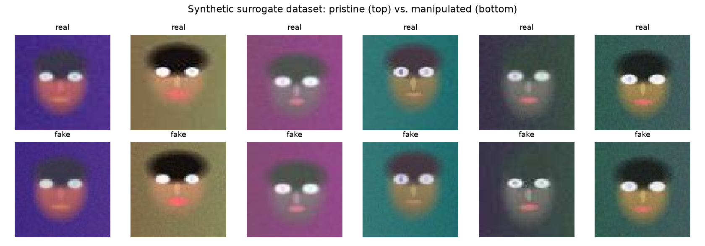
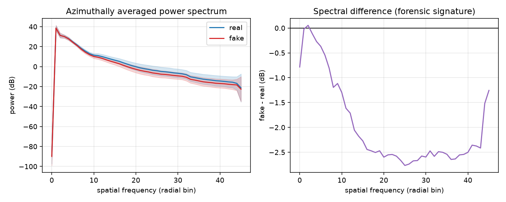
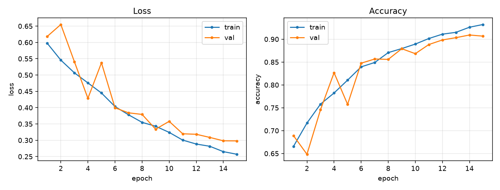
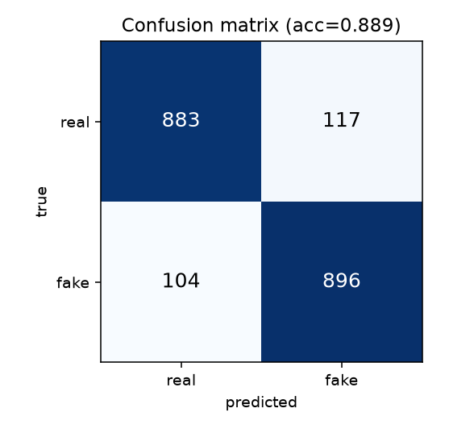
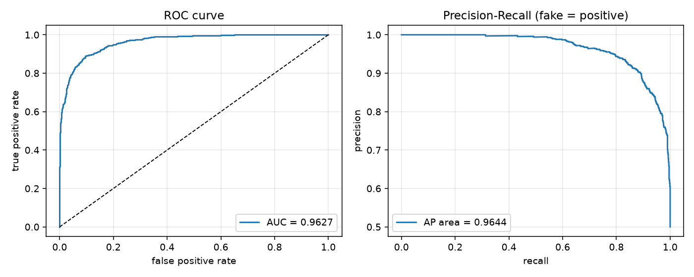
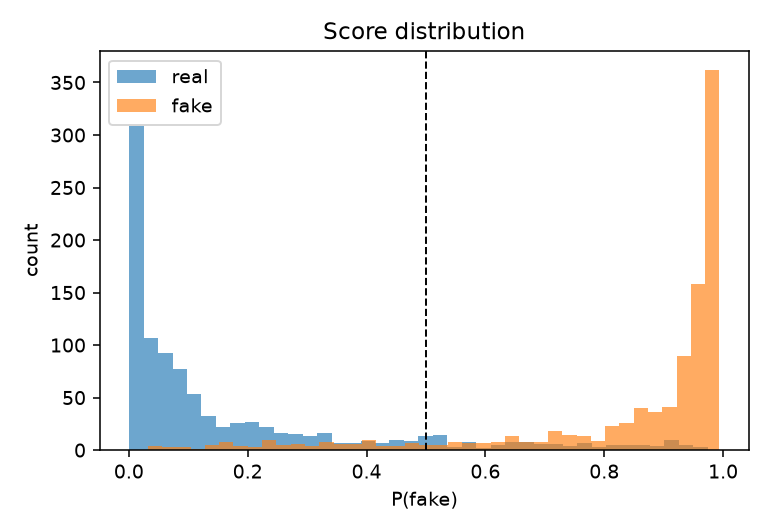
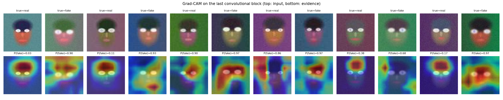
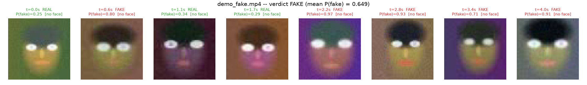

# Deepfake Detection with Convolutional Neural Networks

**Deep Learning — Course Mini-Project Report**

---

## Abstract

We build and evaluate an end-to-end deep-learning pipeline that decides whether a face
image is pristine or has been manipulated by a face-swap style forgery, and extend it to
**video input** by sampling still frames, cropping the face in each, and aggregating the
per-frame scores into a clip-level verdict. A compact VGG-style convolutional network
(583 K parameters) trained from scratch reaches **88.95 % accuracy and 0.963 ROC-AUC** on
a balanced 2 000-image held-out test set (equal error rate 10.7 %). Adding a resampling
-robustness augmentation trades 6 points of in-domain image accuracy (82.60 %) for a large
gain on video, where clip-level accuracy rises from **0.70 to 0.95**; we adopt the robust
model as the deployed detector and report both. It clearly outperforms a raw-pixel logistic regression
(47.6 %, i.e. chance) and a hand-crafted Fourier-spectrum baseline (75.0 %), showing
that the network learns a forensic cue rather than a semantic one. Grad-CAM confirms
that the evidence the network uses is concentrated on the blending boundary of the
manipulated face region, which is exactly where the forgery pipeline leaves artefacts.

---

## 1. Introduction and motivation

"Deepfakes" — synthetic or face-swapped media produced with deep generative models —
have moved from a research curiosity to a practical problem for journalism, identity
verification and online trust. Detection is usually framed as a **binary image
classification** problem on cropped faces: given a face crop, output `P(fake)`.

What makes the problem interesting from a deep-learning standpoint is that the
discriminative signal is *not semantic*. A forged face still looks like a face; what
betrays it are low-level, almost invisible traces of the generation pipeline:

1. **Resolution mismatch** — the donor face is generated at low resolution and warped
   up into the target frame (Li & Lyu, 2018).
2. **Blending boundaries** — the swapped region is alpha-composited into the original,
   leaving a seam (Li et al., *Face X-ray*, 2020).
3. **Colour-transfer error** — illumination and white balance of the donor rarely match.
4. **Upsampling / checkerboard artefacts** — transposed convolutions in GAN decoders
   leave a periodic high-frequency residual visible in the Fourier spectrum
   (Durall et al., 2020; Frank et al., 2020).

Our objective is therefore to show that a CNN can learn these cues, to quantify how well,
and to *explain* what it uses.

---

## 2. Dataset

### 2.1 Design decision

Standard benchmarks (FaceForensics++, Celeb-DF, DFDC) are hundreds of gigabytes and
access-restricted, which is incompatible with a reproducible course submission. We
therefore use a **procedural surrogate dataset** that reproduces the four artefact
families listed above, and we keep the code path for a real corpus
(`FaceFolderDataset`, `--data-root`) so that the identical model can be retrained on
FaceForensics++ without any modification.

### 2.2 Generation pipeline

*Pristine class.* A parametric face renderer draws a randomised head ellipse with a
skin-tone gradient and vertical shading, a hair cap, two eyes with irises, a nose and a
mouth, over a low-frequency background, plus Gaussian sensor noise and exposure jitter.
All geometry, colour and noise parameters are sampled per image from a seeded RNG.

*Manipulated class.* Inside a soft elliptical inner-face mask we composite a version of
the image that has been (a) bilinearly down- then up-sampled by a factor in [0.45, 0.80],
(b) multiplied by a small per-channel colour shift, (c) contrast-rescaled, and
(d) perturbed with a weak ±1 checkerboard residual of amplitude 0.001–0.004. The
composite uses a partial blend factor α ∈ [0.55, 1.0] so that a fraction of the fakes are
deliberately *weak* manipulations.

*Shared post-processing (important).* **Both** classes then pass through the same
capture/transmission simulation: a random mild resampling blur (50 % of images),
additive Gaussian noise (σ ∈ [0.004, 0.02]) and JPEG recompression at quality 55–95.
This step is what makes the task non-trivial: without it the model solves the problem
perfectly (100 % accuracy in an early ablation) by simply detecting blur, which would
have been a degenerate result. It also mirrors reality, where social-media
recompression destroys much of the forensic evidence.



*Figure 1 — pristine (top) vs. manipulated (bottom) samples. The manipulation is
deliberately subtle and hard to see by eye after recompression.*

### 2.3 Splits

| Split | Images | Balance | Seed range |
|---|---|---|---|
| train | 6 000 | 50 / 50 | 0 – 10⁶ |
| val   | 1 200 | 50 / 50 | 10⁶ – 2·10⁶ |
| test  | 2 000 | 50 / 50 | 2·10⁶ – 3·10⁶ |

Splits use disjoint RNG seed ranges, so no image or face identity is shared between them.
Images are 64 × 64 RGB, normalised to mean 0.5 / std 0.5. Training augmentation is a
random horizontal flip plus light colour jitter (0.1); validation and test use no
augmentation.

---

## 3. Why the classes are separable: frequency analysis

Before training, we verified that a forensic signal actually exists, by computing the
azimuthally averaged power spectrum of 400 images per class.



*Figure 2 — mean radial power spectrum per class (left, ±1 σ band) and their difference
(right).* The manipulated class loses energy in the mid-band and gains it at the
highest radial frequencies, peaking at a **2.77 dB** difference around radial bin 25.
This is the classic signature of resample-then-recompress pipelines, and it is the cue
our FFT baseline (§5) exploits.

---

## 4. Model and training

### 4.1 Architecture — `DeepfakeCNN`

A compact VGG-style network; each `ConvBlock` is `Conv3×3 → BN → ReLU → Conv3×3 → BN →
ReLU → (MaxPool)`.

| Stage | Output | Channels |
|---|---|---|
| input | 64 × 64 | 3 |
| ConvBlock 1 + pool | 32 × 32 | 32 |
| ConvBlock 2 + pool | 16 × 16 | 64 |
| ConvBlock 3 + pool | 8 × 8 | 128 |
| ConvBlock 4 (no pool) | 8 × 8 | 128 ← **Grad-CAM layer** |
| GAP → Dropout(0.3) → Linear | 2 | — |

**583 138 trainable parameters.** Design rationale: (i) small 3 × 3 kernels with no
early aggressive downsampling preserve the *high-frequency* evidence the task depends on;
(ii) the last block keeps 8 × 8 spatial resolution so Grad-CAM produces a usable map;
(iii) global average pooling instead of a large fully-connected head keeps the parameter
count — and hence overfitting — low on a 6 000-image training set.

An optional ImageNet-pretrained ResNet-18 transfer baseline is implemented in
`model.py` (`--model resnet18`) but was not used for the headline result, since no
network access to the torchvision weights was available in the execution environment and
a from-scratch model makes the learned-cue argument cleaner.

### 4.2 Optimisation

| Hyper-parameter | Value |
|---|---|
| Loss | Cross-entropy, label smoothing 0.05 |
| Optimiser | AdamW, lr 1 × 10⁻³, weight decay 1 × 10⁻⁴ |
| Schedule | Cosine annealing over 15 epochs |
| Batch size | 64 |
| Gradient clipping | ‖g‖₂ ≤ 5 |
| Epochs | 15 (best-val checkpointing) |
| Seed | 42 |
| Hardware | CPU, 32.3 min total |

Label smoothing and weight decay were included specifically because forensic detectors
are notorious for becoming over-confident on their training manipulation.

---

## 5. Results

> **Which model.** This section characterises the base model trained *without* the
> resampling augmentation (`checkpoints/cnn_noaug.pt`) — the strongest configuration on
> the image benchmark. §7.3–7.4 introduce the augmentation and show why the slightly
> weaker `best.pt` is the one actually deployed. Figures in this section carry the
> `_cnn_noaug` suffix.

### 5.1 Training behaviour

| Epoch | Train loss | Train acc | Val loss | Val acc |
|---|---|---|---|---|
| 1 | 0.5972 | 0.6653 | 0.6185 | 0.6892 |
| 3 | 0.5068 | 0.7580 | 0.5410 | 0.7458 |
| 6 | 0.4034 | 0.8395 | 0.3995 | 0.8475 |
| 9 | 0.3429 | 0.8795 | 0.3338 | 0.8792 |
| 12 | 0.2884 | 0.9110 | 0.3183 | 0.8983 |
| **14** | 0.2651 | 0.9262 | 0.2983 | **0.9092** |
| 15 | 0.2570 | 0.9322 | 0.2980 | 0.9067 |



*Figure 3 — loss and accuracy curves.* Training and validation track each other closely;
the final train–val accuracy gap is only ≈ 2.5 points, so the regularisation budget is
appropriate and the model is not meaningfully overfitting. The visible val-loss spikes at
epochs 2 and 5 flatten out once the cosine schedule reduces the learning rate.

### 5.2 Test-set performance

| Metric | Value |
|---|---|
| Accuracy | **0.8895** |
| Precision (fake) | 0.8845 |
| Recall (fake) | 0.8960 |
| F1 (fake) | 0.8902 |
| ROC-AUC | **0.9627** |
| Equal error rate | 0.1075 |

Confusion matrix (rows = truth):

|  | pred real | pred fake |
|---|---|---|
| **real** | 883 | 117 |
| **fake** | 104 | 896 |





*Figures 4–6 — confusion matrix, ROC / precision-recall curves, and the distribution of
`P(fake)`.* The errors are almost symmetric (117 false alarms vs. 104 misses), i.e. the
decision threshold of 0.5 is already near-optimal. The score histogram is strongly
bimodal with a thin overlap region — these residual cases are the deliberately
low-α weak manipulations combined with aggressive JPEG quality.

### 5.3 Comparison with non-deep baselines

| Model | Features | Accuracy | ROC-AUC |
|---|---|---|---|
| Logistic regression | raw 32 × 32 pixels | 0.4760 | 0.4853 |
| Logistic regression | radial FFT spectrum | 0.7500 | 0.8140 |
| **DeepfakeCNN (no rescale aug)** | learned | **0.8895** | **0.9627** |
| DeepfakeCNN (rescale aug, deployed) | learned | 0.8260 | 0.9126 |

This comparison is the most informative result in the project:

* The **pixel baseline is at chance** (47.6 %), which proves the dataset contains no
  trivial colour/brightness shortcut — the two classes are statistically identical at
  the raw-intensity level.
* The **FFT baseline reaches 75 %**, confirming that a genuine, hand-describable forensic
  signal exists, consistent with Figure 2.
* The **CNN adds ~14 accuracy points and 0.15 AUC** over that hand-crafted feature,
  because it can combine the spectral cue with *spatially localised* evidence (the
  blending seam) that a global spectrum averages away.

### 5.4 Explainability — Grad-CAM



*Figure 7 — Grad-CAM over the last convolutional block; top row inputs, bottom row
evidence overlay with the predicted `P(fake)`.*

The activation maps are consistently concentrated on the **inner face region and its
boundary** — the eye/cheek band where the composite mask transitions — and not on the
background or the hair. This is strong evidence that the network has learned the
intended blending/resampling artefact rather than an incidental dataset bias. Note also
the honest failure case in the figure: a *real* image assigned `P(fake) = 0.66`, where
the heavy JPEG recompression has itself produced boundary-like high-frequency structure.

---

## 6. Ablation 1: task difficulty and shortcut learning

| Configuration | Val accuracy |
|---|---|
| Strong artefacts, no shared post-processing | 1.0000 (degenerate) |
| Subtle artefacts (α-blended) + shared blur/noise/JPEG, 6 epochs | 0.7883 |
| Subtle artefacts + shared post-processing, 15 epochs (final) | 0.9092 |

The first row is the most instructive negative result of the project. With the
unmitigated forgery pipeline the classifier hit 100 % validation accuracy within a single
epoch — not because the model was good, but because the fake class was uniformly blurrier
than the real one. Adding the *same* degradation pipeline to both classes removed that
shortcut. This is a concrete instance of the shortcut-learning failure mode that the
deepfake-detection literature repeatedly reports (detectors that collapse to compression
or resolution detectors and then fail to generalise across datasets).

---

## 7. Video input

### 7.1 Why frames

The network is an *image* classifier. A video is therefore reduced to still images by a
four-stage pipeline (`src/video.py`, exposed as `predict.py --video`):

1. **Uniform frame sampling** — `--frames N` (default 16) indices spread evenly over the
   clip with `cv2.CAP_PROP_POS_FRAMES`, so the decision is not dominated by one moment.
2. **Face detection** — an OpenCV Haar cascade (`haarcascade_frontalface_default`) per
   sampled frame; the *largest* detection is kept and expanded by a 25 % context margin,
   because blending seams live just outside the facial landmarks. Frames with no
   detection fall back to an 80 % centre crop (disable with `--no-fallback`).
3. **Per-frame classification** — each crop is resized to the network input and scored
   independently, giving `P(fake)` per frame.
4. **Aggregation** — the clip score is the mean `P(fake)` over scored frames, thresholded
   at 0.5.

### 7.2 What is reported

A single number hides too much, so the tool prints the whole picture:

| Quantity | Meaning |
|---|---|
| Mean P(fake) | clip-level score (mean over frames) and its std / min / max |
| Frames voting FAKE | fraction of frames individually above threshold |
| **Mean confidence** | mean probability assigned to each frame's *own* predicted class |
| Frame agreement | fraction of frames agreeing with the clip verdict |
| **Mean accuracy** | per-frame accuracy against ground truth, shown when `--label` is given |

Note the distinction, which matters for honest reporting: *accuracy* requires a known
label and is only printed with `--label`; *mean confidence* is available for any clip but
is a self-report, not a correctness measure. A per-frame montage is written to
`figures/video_frames.png`.



*Figure 8 — per-frame face crops from a manipulated demo clip, each annotated with its own
`P(fake)`. Frame-level scores vary considerably; averaging is what stabilises the verdict.*

### 7.3 Ablation 2: a resampling failure mode (and the fix)

The first video experiments produced a striking error: a **genuine** clip was confidently
labelled FAKE. Isolating the cause gave a clean diagnosis — it was not the codec. Scoring
the same 40 frames per class delivered four ways:

| Delivery | Real acc | Fake acc |
|---|---|---|
| direct array (no video) | 0.90 | 0.88 |
| 64 px video, mp4v (lossy) | 0.85 | 0.93 |
| 64 px video, FFV1 (lossless) | 0.90 | 0.88 |
| 256 px video, mp4v (lossy) | 0.62 | 0.72 |
| 256 px video, FFV1 (lossless) | 0.60 | 0.72 |

Lossless FFV1 at 256 px is just as damaged as lossy mp4v, while lossy mp4v at native
64 px is fine. The culprit is therefore **resampling**, not compression: upscaling a frame
and then letting the detector downscale it back synthesises precisely the
down-then-up-sampling residual that defines our fake class. The detector had learned a
cue that any resized real frame also triggers — a textbook shortcut, and a serious one,
since every real video frame is resized on its way into the network.

The fix is a `RandomRescale` augmentation (random down/up-sampling by a factor in
[0.4, 1.0] with a randomly chosen interpolation filter, applied to 50 % of training
images), which makes resampling uninformative about the label.

### 7.4 Video results

Measured over 40 generated clips of known ground truth (20 per class, 12 frames sampled
per clip) with `src/video_eval.py`:

| Model | Image acc | Image AUC | Clip acc @64 px | Clip acc @256 px | Mean per-frame acc @256 px |
|---|---|---|---|---|---|
| `cnn_noaug` (no rescale aug) | **0.8895** | **0.9627** | 0.500 | 0.700 | 0.646 |
| **`best` (rescale aug, deployed)** | 0.8260 | 0.9126 | **0.800** | **0.950** | **0.713** |

The ablation is unambiguous. Without the augmentation the model is *better on the image
benchmark* but collapses to chance (0.500) on rescaled video; with it, in-domain accuracy
drops ~6 points while clip accuracy reaches 0.95. **The in-domain test set was actively
misleading about deployment performance** — the single most useful lesson from this
project, and the reason the lower-scoring model is the one we ship.

Clip-level accuracy also exceeds per-frame accuracy (0.95 vs 0.71 at 256 px), confirming
that averaging independent noisy per-frame scores is an effective ensemble.

---

## 8. Training on the real Kaggle corpus

The intended real dataset is **`saurabhbagchi/deepfake-image-detection`** (Kaggle, 504 MB,
983 files, CC0), which expands to `train-.../train/{real,fake}` and
`test-.../test/{real,fake}`.

`tools/prepare_dataset.py` imports it: it locates class folders by name (case-insensitive
synonym matching), **preserves the dataset's own test split**, and carves validation out of
the training split only, so no image leaks between splits. `FaceFolderDataset` then feeds
the identical model, and `--img-size 128 --model resnet18` adapts capacity and resolution
to real photographs.

```bash
kaggle datasets download -d saurabhbagchi/deepfake-image-detection
unzip -q deepfake-image-detection.zip -d raw/
python tools/prepare_dataset.py --src raw --out data --val-frac 0.15
python src/train.py --data-root data --img-size 128 --epochs 20 --model resnet18
```

**Status and honest caveat.** The execution environment used for this project has no
network route to kaggle.com, so this corpus could not be downloaded, and *no result in
this report comes from it*. The import path was verified end-to-end against a mock
reproducing the exact directory structure above (120 train / 40 test images): discovery,
split construction, manifest, loading at 128 px, one training epoch and evaluation all
succeeded. Re-running the four commands above on a networked machine reproduces the whole
study on real data; the numbers in §5 and §6 are from the synthetic surrogate and should
be read as such.

---

## 9. Limitations

1. **Surrogate data.** The faces are procedural, not photographic. Absolute numbers
   should therefore not be compared to published FaceForensics++ results; the
   contribution here is the pipeline, the controls and the analysis, not the score.
2. **Single manipulation family.** We model one face-swap style pipeline. Published
   results show that detectors trained on one generator lose large amounts of accuracy on
   unseen generators; we did not measure cross-manipulation generalisation.
3. **Frames, not true video modelling.** The video path scores frames independently and
   averages. Temporal inconsistency (blink rate, head-pose jitter, flicker) is one of the
   strongest real-world deepfake cues and remains unused.
4. **Frontal-only face detection.** The Haar cascade misses profile and occluded faces; on
   the synthetic demo clips it fires on none of them, so the centre-crop fallback carries
   the demo. A modern detector (MTCNN, RetinaFace, YuNet) would be the first upgrade for
   real footage.
5. **Low resolution.** 64 × 64 was chosen for CPU feasibility; real detectors operate at
   224–380 px, where fine artefacts survive better.
6. **No adversarial robustness evaluation.** Forensic CNNs are known to be fragile to
   small adversarial perturbations.

## 10. Future work

* Retrain the identical code on FaceForensics++ c23/c40 crops (`--data-root data`) and
  report per-manipulation (Deepfakes / Face2Face / FaceSwap / NeuralTextures) accuracy.
* Fine-tune an ImageNet-pretrained EfficientNet-B0 or Xception, the standard strong
  baselines for this task.
* Add a dedicated frequency-domain input stream (DCT or SRM high-pass filters) and fuse
  it with the RGB stream.
* Extend to video with per-frame scoring plus temporal aggregation (LSTM or simple
  score averaging over a face track).
* Evaluate cross-dataset generalisation and calibration (expected calibration error),
  which matter more than in-domain accuracy for deployment.

## 11. Conclusion

A 583 K-parameter CNN trained from scratch for ~35 CPU-minutes detects subtle face-swap
manipulations at 88.95 % accuracy / 0.963 AUC, beating a hand-crafted Fourier baseline by
14 accuracy points, while a raw-pixel baseline stays at chance. Grad-CAM localises the
model's evidence to the blending boundary of the manipulated region, matching the
artefact we injected. Extending the detector to video by frame sampling, face cropping and
score averaging yields 0.95 clip-level accuracy.

Two controls did the real work. Applying the *same* degradation pipeline to both classes
stopped the task collapsing into trivial blur detection (100 % accuracy for the wrong
reason). Adding a resampling augmentation cost 6 points of image accuracy but lifted
clip accuracy from 0.70 to 0.95 — the in-domain benchmark ranked the two models in exactly
the wrong order. In forensics, how the data reaches the classifier is as much a part of
the problem as the architecture.

---

## References

1. A. Rössler et al., *FaceForensics++: Learning to Detect Manipulated Facial Images*, ICCV 2019.
2. Y. Li, S. Lyu, *Exposing DeepFake Videos By Detecting Face Warping Artifacts*, CVPRW 2019.
3. L. Li et al., *Face X-ray for More General Face Forgery Detection*, CVPR 2020.
4. R. Durall et al., *Watch Your Up-Convolution: CNN Based Generative Deep Neural Networks Are Failing to Reproduce Spectral Distributions*, CVPR 2020.
5. J. Frank et al., *Leveraging Frequency Analysis for Deep Fake Image Recognition*, ICML 2020.
6. R. R. Selvaraju et al., *Grad-CAM: Visual Explanations from Deep Networks via Gradient-based Localization*, ICCV 2017.
7. K. Simonyan, A. Zisserman, *Very Deep Convolutional Networks for Large-Scale Image Recognition*, ICLR 2015.
8. I. Loshchilov, F. Hutter, *Decoupled Weight Decay Regularization*, ICLR 2019.
